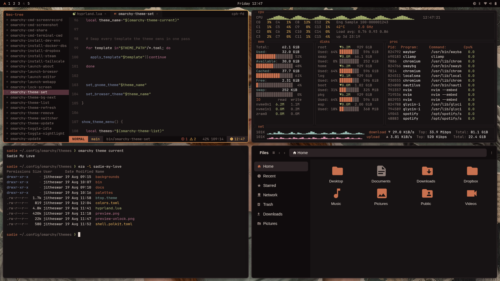

# Sadie My Love

An [Omarchy](https://omarchy.org) theme in copper and oxblood, whose palette follows its own wallpaper.



Most themes ship one palette and a folder of wallpapers that may or may not agree with it.
This one ships four wallpapers and derives a palette for each, so switching the background re-tints the whole desktop - bar, borders, terminal, btop, editor - without ever turning into a different theme.

## Install

```
omarchy theme install https://github.com/Jitheswar/sadie-my-love
```

Or clone it into place yourself:

```
git clone https://github.com/Jitheswar/sadie-my-love \
  ~/.config/omarchy/themes/sadie-my-love
omarchy theme set sadie-my-love
```

Cycle the wallpaper with `omarchy theme bg next` (`SUPER + CTRL + SHIFT + SPACE` by default) and the palette follows within a second.

## How the palette works

There is one hand-tuned palette, held as `REFERENCE` in `bin/generate-palettes`.
It carries the properties worth protecting: an even L\* ladder through the backgrounds, low-chroma body text, at least 4.5:1 contrast on every text colour, and ANSI hues that stay distinguishable from each other.

Each wallpaper contributes only a **hue rotation** to that palette, taken from its own dominant colour.
Lightness and chroma are never touched, so the contrast and separation guarantees survive by construction rather than by luck.
The rotation is done in Oklch - a naive HSL rotation swings yellows much further than reds and pulls the palette apart.

Three things keep the rotations from drifting into unrelated themes:

| | |
|---|---|
| **Strength** | Only 70% of each wallpaper's measured offset is applied. |
| **Clamp** | Rotation is capped at 28 degrees, so one outlier wallpaper cannot swing the UI somewhere that no longer belongs to this theme. |
| **Damping** | Near-neutral slots take a fraction of the rotation, so a hue shift does not read as a colour cast on plain text or plain surfaces. |

In practice the four wallpapers land at +0.0, -19.2, -9.2 and +2.2 degrees.

Colour extraction alone was not enough to get here. On `01-1412030` a raw extraction collapses six of sixteen slots to within a few RGB units of each other, which makes a passing test and a failing test the same colour. Hence the hand-tuned reference plus a rotation, rather than per-wallpaper extraction.

## Everything themed is derived

No file in this theme has colours written into it literally.
Every artefact that carries colour is computed from `colors.toml` at apply time, so it rotates with everything else.
A hand-written `btop.theme` would have held the reference copper while the bar and borders rotated 19 degrees away from it on wallpaper 02, which is obvious side by side.

`docs/adr/0001-every-themed-artefact-is-derived.md` has the reasoning and the options that were rejected.

## Layout

```
backgrounds/          the four wallpapers
palettes/             one colors.toml per wallpaper, generated
colors.toml           the live palette, a copy of one of the above
bin/generate-palettes rebuild palettes/ from the reference palette
bin/generate-btop     rebuild btop.theme from the live palette
bin/generate-preview  rebuild preview.png from the live palette
bin/apply-palette     swap colors.toml to match the current wallpaper
bin/palette-watcher   run apply-palette when the wallpaper changes
hyprland.lua          borders, rounding, shadow, blur
shell.*.toml          per-section overrides for the Omarchy shell
```

`palette-watcher` exists because Omarchy fires no hook on a background change; it follows the background symlink directly.
It is a singleton, and it exits on its own once this theme is no longer active, so nothing is left running for other themes to trip over.
Hyprland starts it from `hyprland.lua`.

## Regenerating

```
bin/generate-palettes            # after editing REFERENCE or adding a wallpaper
bin/generate-preview             # after a palette change
bin/generate-preview palettes/02-1331868.toml   # pin the tile to one wallpaper
```

`generate-preview` needs `chromium` and `imagemagick`; it lays the desktop out in `bin/preview-template.html`, fills it with the live palette, and screenshots it headlessly, so the tile cannot advertise colours the theme does not apply.

Omarchy's theme picker caches its thumbnails on directory mtime, so a regenerated `preview.png` may not show up until the cache is nudged:

```
rm -f ~/.cache/omarchy/image-selector/*.rows \
      ~/.cache/omarchy/image-selector/*.signature \
      ~/.cache/omarchy/image-selector/*.fast-signature
touch ~/.config/omarchy/themes/sadie-my-love
```

## Credits

Wallpapers are fan collages of Sadie Sink, collected from public wallpaper sites; they belong to their original creators and are included here only so the theme ships with the backgrounds it was tuned against.
Icons are Yaru-wartybrown.
